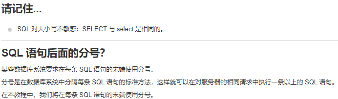

# SQL语句介绍

###### 谢融 41911030


## 一、SQL简介

​	在介绍SQL语句之前，我们先了解一下SQL是什么。SQL指结构化查询语言，全程是“Structured Query Language”，它可以让我们访问以及处理数据库，包括数据插入、查询、更新和删除。SQL在1986年成为ANSI的一项标准，在1987年成为国际标准化组织(ISO)标准。

## 二、SQL能做什么

1. 面向数据库执行操作
2. 从数据库取回数据
3. 数据库中插入新的记录
4. 更新数据库中的数据
5. 从数据库删除记录
6. 创建新的数据库
7. 在数据库中创建新表
8. 在数据库中创建存储过程
9. 在数据库中创建视图
10. 设置表、存储过程和视图的权限

## 三、SQL语句

### 一些重要的SQL命令：

| 命令            | 命令含义             |
| --------------- | -------------------- |
| SELECT          | 从数据库中提取数据   |
| UPDATE          | 更新数据库中的数据   |
| DELETE          | 从数据库中删除数据   |
| INSERT INTO     | 向数据库中插入新数据 |
| CREATE DATABASE | 创建新数据库         |
| ALTER DATABASE  | 修改数据库           |
| CREATE TABLE    | 创建新表             |
| ALTER TABLE     | 变更（改变）数据库表 |
| DROP TABLE      | 删除表               |
| CREATE INDEX    | 创建索引（搜索键）   |
| DROP INDEX      | 删除索引             |

### 一些SQL语句实例：

```sql
/*1.查询——SELECT语句*/
SELECT column_name,column_name
FROM table_name;/*从表table_name里面查询column_name,column_name*/
SELECT * FROM table_name;/*从表table_name里面查询所有内容*/

/*2.WHERE子句*/
SELECT column_name,column_name
FROM table_name
WHERE column_name operator value;/*用于提取满足指定条件的记录*/

/*3.AND&OR运算符*/
SELECT * FROM Websites
WHERE country='CN'
AND alexa > 50;/*从 "Websites" 表中选取国家为 "CN" 且alexa排名大于 "50" 的所有网站*/
SELECT * FROM Websites
WHERE country='USA'
OR country='CN';/*从 "Websites" 表中选取国家为 "USA" 或者 "CN" 的所有客户*/
```

### 一些注意事项：



## 四、教程推荐

推荐的教程网站[菜鸟教程](https://www.runoob.com/markdown/md-tutorial.html)

